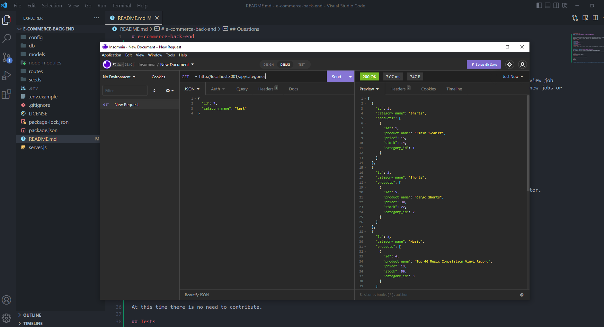

# e-commerce-back-end

## Description

This application was made to provide companies with the best back-end code to help run an e-commerce website. E-commerce generates trillions of dollars so having a working back-end code can help make money and the better the code the better it is to view data.

## Table of Contents

- [Installation](#installation)
- [Usage](#usage)
- [License](#license)
- [Contributing](#contributing)
- [Tests](#tests)
- [Questions](#questions)

## Installation

To install, the user needs to clone the repo and have Node installed. Once that is done the user can run the command to start the server and view the data on insomnia.

## Usage

Video Walkthrough: https://app.castify.com/view/1f42d0d8-b4e6-418e-98c7-3c74e64764a8

You use the command line to start the server and then use insomnia to view data

## License

This project is license under MIT

## Contributing

At this time there is no need to contribute.

## Tests

npm run seed, npm start

## Questions

If you have any questions, please email me at Tyler.Kand2@gmail.com. You can also view more of my work at https://github.com/TylerKandarian.